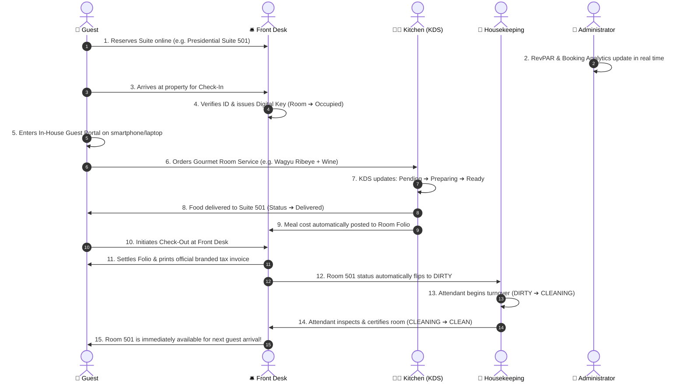
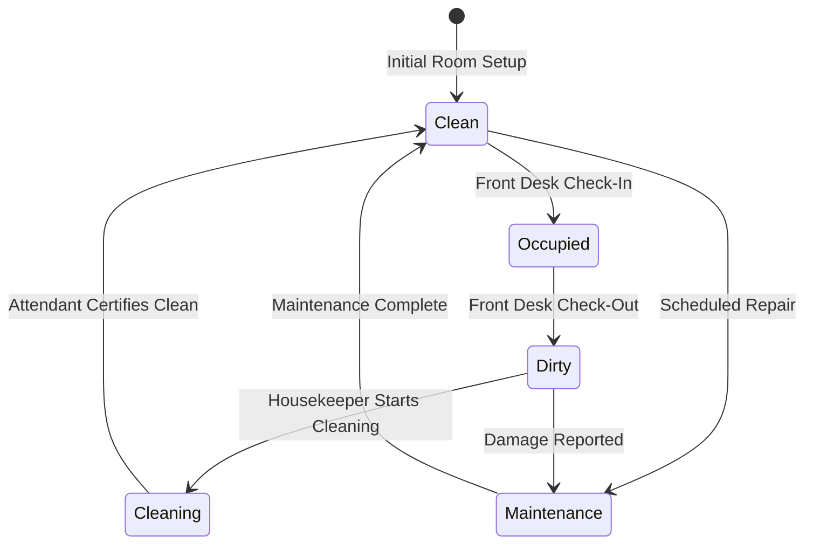
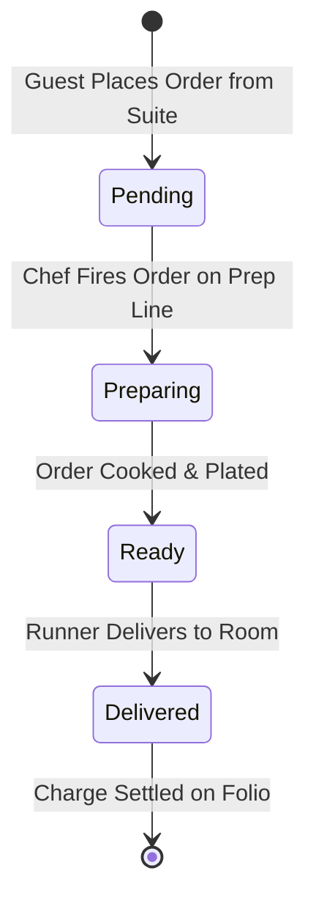

# 🏨 Efoy Hotel & Suites — Complete End-to-End User Interaction Workflow

> **Document Version**: 2.0.0  
> **Platform**: PERN Stack (PostgreSQL 16, Express.js, React 19, Node.js)  
> **Architecture**: Multi-Role Property Management System (PMS) & Luxury Guest Portal  
> **Target Audience**: Guests, Front Desk Staff, Culinary Team, Housekeeping, Hotel Executives & Developers  

---

## 📑 Table of Contents

1. [System Architecture & Persona Matrix](#1-system-architecture--persona-matrix)
2. [Global Operational Lifecycle (Mermaid Diagram)](#2-global-operational-lifecycle)
3. [Persona 1: The Public Visitor & Guest Journey](#3-persona-1-the-public-visitor--guest-journey)
   - [3.1 Discovery & Landing Page Exploration](#31-discovery--landing-page-exploration)
   - [3.2 Account Registration & Luxury Sign-In](#32-account-registration--luxury-sign-in)
   - [3.3 Room Search, Date Filtering & Suite Booking](#33-room-search-date-filtering--suite-booking)
   - [3.4 In-House Guest Portal Experience](#34-in-house-guest-portal-experience)
   - [3.5 In-Room Dining & Room Service Ordering](#35-in-room-dining--room-service-ordering)
   - [3.6 Service Requests & Digital Folio / Printable Invoice](#36-service-requests--digital-folio--printable-invoice)
   - [3.7 Express Digital Checkout](#37-express-digital-checkout)
4. [Persona 2: The Front Desk / Receptionist Workflow](#4-persona-2-the-front-desk--receptionist-workflow)
   - [4.1 Shift Login & Dashboard Overview](#41-shift-login--dashboard-overview)
   - [4.2 Handling Reservations & Walk-in Arrivals](#42-handling-reservations--walk-in-arrivals)
   - [4.3 Check-In Execution & Digital Key Issuance](#43-check-in-execution--digital-key-issuance)
   - [4.4 Managing In-House Guest Folios & Live Charges](#44-managing-in-house-guest-folios--live-charges)
   - [4.5 Guest Checkout & Automated Housekeeping Handoff](#45-guest-checkout--automated-housekeeping-handoff)
5. [Persona 3: The Kitchen Display System (KDS) & Culinary Workflow](#5-persona-3-the-kitchen-display-system-kds--culinary-workflow)
   - [5.1 Live KDS Station Dashboard](#51-live-kds-station-dashboard)
   - [5.2 Receiving In-Room Dining Orders](#52-receiving-in-room-dining-orders)
   - [5.3 4-Stage Culinary Order Progression](#53-4-stage-culinary-order-progression)
   - [5.4 Live Dish Availability & Stock Management (86'ing Dishes)](#54-live-dish-availability--stock-management-86ing-dishes)
6. [Persona 4: Housekeeping & Facility Operations Workflow](#6-persona-4-housekeeping--facility-operations-workflow)
   - [6.1 Housekeeping Board & Room Cleanliness Matrix](#61-housekeeping-board--room-cleanliness-matrix)
   - [6.2 Room Turnover Lifecycle](#62-room-turnover-lifecycle)
   - [6.3 One-Click Clean Certification & Inspection](#63-one-click-clean-certification--inspection)
7. [Persona 5: Hotel Administrator & Executive Workflow](#7-persona-5-hotel-administrator--executive-workflow)
   - [7.1 Executive KPI & Revenue Analytics Dashboard](#71-executive-kpi--revenue-analytics-dashboard)
   - [7.2 Room Inventory & Tariff Management](#72-room-inventory--tariff-management)
   - [7.3 Culinary Menu Catalog Management](#73-culinary-menu-catalog-management)
   - [7.4 Personnel Directory & Shift Scheduling](#74-personnel-directory--shift-scheduling)
   - [7.5 Activity Audit Stream & Property Settings](#75-activity-audit-stream--property-settings)
8. [Safety & Security Interaction Patterns](#8-safety--security-interaction-patterns)
   - [8.1 Global Sign-Out Confirmation Flow](#81-global-sign-out-confirmation-flow)
   - [8.2 Destructive Action Confirmation Dialogs](#82-destructive-action-confirmation-dialogs)
   - [8.3 Role-Based Access Control (RBAC) Protection](#83-role-based-access-control-rbac-protection)
9. [Summary State Machines](#9-summary-state-machines)

---

## 1. System Architecture & Persona Matrix

Efoy Hotel & Suites operates as a unified property ecosystem where every interaction across the web interface instantly reflects in the PostgreSQL database and propagates across role portals.

```
+------------------------------------------------------------------------------------+
|                               EFOY HOTEL PLATFORM                                  |
+------------------------------------------------------------------------------------+
       |                     |                     |                     |
       v                     v                     v                     v
+--------------+      +--------------+      +--------------+      +--------------+
|    GUEST     |      |  FRONT DESK  |      |   KITCHEN    |      | HOUSEKEEPING |
|  - Booking   |      |  - Check-in  |      |  - KDS Queue |      |  - Turnover  |
|  - Dining    |      |  - Folios    |      |  - 4 Stages  |      |  - Sanitize  |
|  - Invoices  |      |  - Check-out |      |  - 86 Dishes |      |  - Certify   |
+--------------+      +--------------+      +--------------+      +--------------+
       \                     /                     \                     /
        ---------------------                       ---------------------
                                      |
                                      v
                             +------------------+
                             |  ADMINISTRATOR   |
                             |  - RevPAR KPIs   |
                             |  - Room Control  |
                             |  - Menu Control  |
                             |  - Staff Control |
                             |  - Audit Stream  |
                             +------------------+
```

### Persona Overview

| Persona | Primary Goal | Access Key / Portal | Primary Actions |
|---|---|---|---|
| **🌟 Guest (Public / In-House)** | Discover, book, stay, order food, and view billing | Landing Page & Guest Portal (`/guest`) | Room booking, dining orders, service requests, folio invoice |
| **🛎️ Front Desk / Receptionist** | Manage front-of-house arrivals, departures & keys | Front Desk Portal (`/receptionist`) | Check-in, room assignments, walk-in reservations, check-out |
| **👨‍🍳 Kitchen / Culinary Team** | Fulfill in-room dining orders with zero delay | Kitchen KDS (`/kitchen`) | Stage advancement (`Pending` ➔ `Preparing` ➔ `Ready` ➔ `Delivered`) |
| **🧹 Housekeeping Staff** | Ensure all suites are sanitized and inspected | Housekeeping Portal (`/housekeeping`) | Turnover management, cleanliness audit, clean certification |
| **👑 General Manager / Admin** | Maximize revenue, supervise operations, and audit | Admin Dashboard (`/admin`) | KPI trends, room/menu/staff CRUD, system configuration |

---

## 2. Global Operational Lifecycle

The diagram below illustrates how a single guest reservation triggers interconnected operations across all hotel departments:



---

## 3. Persona 1: The Public Visitor & Guest Journey

### 3.1 Discovery & Landing Page Exploration
1. **Initial Visit**: The user lands on the homepage (`/`).
2. **Hero Presentation**: The user is welcomed by high-resolution imagery of the luxury suites, quick search widget, and the hotel's 5-star brand identity.
3. **Navigation Options**:
   - **Suites Showcase**: Visual preview of Deluxe, Executive, and Presidential suites with nightly tariffs, bed configurations, and luxury amenities.
   - **In-Room Dining**: Live gourmet culinary catalog displaying dishes, prices, and dietary indicators (Vegetarian, Gluten-Free, Chef Specials).
   - **Amenities**: Spa, Rooftop Infinity Pool, High-Speed Fiber WiFi, Executive Lounge, and Concierge services.
   - **Guest Testimonials**: Verified ratings and traveler experiences.
   - **Interactive Location & Contact**: Address, airport transfer info, phone, and inquiry form.

### 3.2 Account Registration & Luxury Sign-In
1. **Opening Auth Modal**: The user clicks the **Sign In** button in the top navigation bar.
2. **Sign-In Flow**:
   - The user enters their registered Email and Password.
   - User can click the **Eye Icon** to toggle password visibility.
   - Clicks **Access Account** ➔ Frontend validates fields ➔ Sends POST request to `/api/auth/login` ➔ JWT token issued and stored securely.
3. **New User Registration Flow**:
   - User clicks the **Create Account** tab.
   - Enters **Full Name**, **Email Address**, **Phone Number**, and **Password**.
   - Agrees to the Terms & Privacy Policy checkbox.
   - Clicks **Complete Registration** ➔ System creates guest profile in PostgreSQL ➔ Instantly signs user in.
4. **Role Routing**: Upon authentication, the system automatically redirects the user:
   - Guests ➔ In-House Guest Experience
   - Staff/Admins ➔ Their respective operational portal

### 3.3 Room Search, Date Filtering & Suite Booking
1. **Search Widget**: The user selects **Check-In Date**, **Check-Out Date**, **Room Category** (Standard, Deluxe, Suite, Presidential), and **Guests Count**.
2. **Availability Check**: The platform queries PostgreSQL `/api/rooms` filtering out currently occupied or maintenance rooms.
3. **Selecting a Room**: The user clicks **Book Suite** on their chosen room card.
4. **Reservation Modal**:
   - Displays stay summary: number of nights, base rate, taxes, and total estimated cost.
   - User inputs guest names, special requests (e.g., high floor, extra pillows, late check-in).
   - Confirms booking ➔ POST to `/api/bookings` creates booking reference (e.g., `BK-8905`) with status `confirmed`.

### 3.4 In-House Guest Portal Experience
Once checked into a room, the guest accesses their personalized **Guest Stay Portal**:
- **Welcome Header**: Displays guest name, room number (e.g., `Suite 501`), and stay dates.
- **Digital Keycard**: Live NFC/RFID key simulation showing room access active status.
- **Quick Amenities**: High-speed WiFi credentials, hotel extensions, front desk messaging.
- **Folio Overview**: Live tally of room charges, restaurant orders, and taxes.

### 3.5 In-Room Dining & Room Service Ordering
1. **Browsing Catalog**: Guest navigates to the **Room Service** section.
2. **Filtering Dishes**: Filter by category (*Starters*, *Mains*, *Desserts*, *Beverages*, *Wine*).
3. **Customizing Order**: Click on any dish (e.g., *Pan-Seared Atlantic Salmon*), select quantity, and add special dietary instructions.
4. **Checkout**:
   - Guest reviews the order cart.
   - Selects delivery room number (pre-filled with their active suite).
   - Confirms order ➔ Dispatches POST to `/api/orders`.
   - Charge is automatically linked to the room's billing folio!
   - Live order tracking badge appears: `Pending` ➔ `Preparing` ➔ `Ready` ➔ `Delivered`.

### 3.6 Service Requests & Digital Folio / Printable Invoice
1. **Requesting Hotel Services**:
   - Guest can request Extra Towels, Luggage Assistance, Wake-Up Call, or Turndown Service with 1-click.
2. **Viewing Live Folio**:
   - Itemized list of room tariff per night + dining orders + applicable taxes.
3. **Printable Invoice**:
   - Guest clicks **Download / Print Invoice**.
   - System renders the high-end `PrintableInvoice.jsx` component complete with official hotel branding, guest details, booking code, itemized billing, and tax breakdown ready for corporate expense reporting.

### 3.7 Express Digital Checkout
1. Guest reviews final folio balance.
2. Clicks **Request Express Checkout**.
3. Notifies Front Desk staff to finalize billing and release the room.

---

## 4. Persona 2: The Front Desk / Receptionist Workflow

### 4.1 Shift Login & Dashboard Overview
1. Front desk staff logs in with receptionist credentials.
2. Dashboard displays four real-time operational tiles:
   - **Today's Expected Arrivals**
   - **Today's Expected Departures**
   - **Current Occupancy Percentage**
   - **Dirty Rooms Awaiting Turnover**

### 4.2 Handling Reservations & Walk-in Arrivals
1. **Scheduled Arrivals**:
   - Staff locates guest by searching name or reservation ID in the live bookings table.
   - Reviews stay dates, assigned suite, and guest notes.
2. **Walk-in Reservations**:
   - Staff clicks **New Walk-In Check-In**.
   - System displays all currently `Clean` and `Available` rooms.
   - Receptionist enters guest identity, contact information, length of stay, and room selection.
   - Clicks **Create & Check In**.

### 4.3 Check-In Execution & Digital Key Issuance
1. Staff clicks **Check In** button on the booking row.
2. System performs atomic updates:
   - Booking status changes from `confirmed` to `checked-in`.
   - Room status automatically transitions to `Occupied`.
   - Generates digital key access code.
   - Activity log registers: *"Guest checked into Suite 301 by Front Desk"*.

### 4.4 Managing In-House Guest Folios & Live Charges
1. Receptionist clicks **View Folio** for any active room.
2. System displays all posted charges:
   - Daily room rate.
   - Room service culinary orders delivered to the suite.
   - Incidentals or minibar charges.
3. Staff can post manual adjustments or complimentary discounts.

### 4.5 Guest Checkout & Automated Housekeeping Handoff
1. When guest departs, staff clicks **Check Out**.
2. Balance settlement screen confirms payment receipt (Credit Card, Cash, or Direct Bill).
3. Staff prints final receipt or emails digital invoice.
4. **Automated Cleaning Trigger**:
   - Room status automatically changes to **`Dirty`**.
   - Housekeeping board is updated instantly without phone calls or radio delays!
   - Booking status marks as `checked-out`.

---

## 5. Persona 3: The Kitchen Display System (KDS) & Culinary Workflow

### 5.1 Live KDS Station Dashboard
- High-contrast, touch-optimized Kitchen Display System mounted in the culinary prep area.
- Grouped into 4 status columns:
  1. 🟡 **Pending Orders** (Newly placed by guests)
  2. 🔵 **In Preparation** (Active on grill / prep line)
  3. 🟢 **Ready for Service** (Plated and waiting for room runner)
  4. ⚪ **Delivered** (Completed orders)

### 5.2 Receiving In-Room Dining Orders
1. A guest places an order from their suite.
2. A new order ticket appears on the KDS board containing:
   - Order Number (e.g. `#ORD-1042`)
   - Suite Number (e.g. `Suite 402`)
   - Elapsed timer since order placement
   - Itemized dishes, quantities, and special requests (e.g., *"No onions, dressing on side"*)

### 5.3 4-Stage Culinary Order Progression
Culinary staff advance the order through its operational lifecycle with single-tap controls:

```
[ GUEST PLACES ORDER ]
         |
         v
+------------------+
|   1. PENDING     |  --> Order ticket appears on KDS with audio alert
+------------------+
         | (Chef taps "Start Preparing")
         v
+------------------+
|  2. PREPARING    |  --> Cooking timer starts, food is actively cooked
+------------------+
         | (Chef taps "Mark as Ready")
         v
+------------------+
|    3. READY      |  --> Order plated; runner alerted for room delivery
+------------------+
         | (Runner delivers to Suite & taps "Delivered")
         v
+------------------+
|   4. DELIVERED   |  --> Ticket archived; charges confirmed on Room Folio
+------------------+
```

### 5.4 Live Dish Availability & Stock Management (86'ing Dishes)
1. If an ingredient runs out during a shift, the chef accesses the **Menu Stock** tab.
2. Toggles dish availability to **Out of Stock** (86'd).
3. The dish immediately becomes unavailable for guests ordering online, preventing culinary fulfillment delays.

---

## 6. Persona 4: Housekeeping & Facility Operations Workflow

### 6.1 Housekeeping Board & Room Cleanliness Matrix
Housekeeping attendants view a real-time visual grid of every room in the hotel categorized by color-coded cleanliness badges:
- 🟢 **Clean**: Sanitized, inspected, and ready for immediate guest check-in.
- 🔴 **Dirty**: Guest has checked out or daily turnover is required.
- 🟡 **Cleaning**: Attendant is actively servicing the room.
- 🟣 **Inspected**: Supervisor has reviewed cleanliness standards.
- ⚫ **Maintenance**: Out of order for repairs or renovation.

### 6.2 Room Turnover Lifecycle
When a room is marked `Dirty` (after guest check-out or daily service schedule):

```
+-----------------------------------------------------------------------------------+
|                           ROOM TURNOVER WORKFLOW                                  |
+-----------------------------------------------------------------------------------+

[ FRONT DESK CHECKOUT ]
           |
           v
    +--------------+
    |    DIRTY     |  --> Attendant arrives at suite with turnover cart
    +--------------+
           |
           | (Attendant taps "Start Cleaning")
           v
    +--------------+
    |   CLEANING   |  --> Bedding stripped, surfaces disinfected, bathroom sanitized,
    +--------------+      amenities restocked (shampoo, robes, towels)
           |
           | (Attendant taps "Complete & Certify Clean")
           v
    +--------------+
    |    CLEAN     |  --> Room instantly unlocked on Front Desk grid for Check-In!
    +--------------+
```

### 6.3 One-Click Clean Certification & Inspection
1. Attendant selects room card (e.g. `Room 201`).
2. Reviews turnover checklist:
   - [x] Fresh luxury linen and pillow protectors
   - [x] Bathroom sanitization & seal
   - [x] Mini-bar restocked
   - [x] Climate control set to welcome temperature (21°C / 70°F)
3. Attendant taps **Certify Clean**.
4. System logs the timestamp, attendant ID, and changes room status to `Clean`.
5. Front Desk screen reflects the update instantly!

---

## 7. Persona 5: Hotel Administrator & Executive Workflow

### 7.1 Executive KPI & Revenue Analytics Dashboard
Executives access strategic performance indicators calculated across all database tables:
- **Total Revenue**: Sum of room charges + dining orders + service fees.
- **Average Daily Rate (ADR)**: `Total Room Revenue / Number of Sold Rooms`.
- **Revenue Per Available Room (RevPAR)**: `Total Room Revenue / Total Available Rooms`.
- **Occupancy Rate**: Real-time percentage of rooms currently occupied.
- **Visual Trends**: Interactive charts showing monthly revenue, occupancy curves, and top-selling culinary items.

### 7.2 Room Inventory & Tariff Management
1. **Adding a New Suite**:
   - Admin clicks **Add New Room**.
   - Inputs Room Number, Type (*Deluxe*, *Executive Suite*, *Presidential*), Floor, Capacity, Nightly Rate ($), and Amenities.
   - Clicks Save ➔ Created in PostgreSQL database.
2. **Editing Existing Rooms**:
   - Update nightly tariffs based on peak/off-peak season.
   - Toggle maintenance mode for repairs.
3. **Deleting Rooms**:
   - Admin clicks delete button.
   - Protected by safety confirmation dialog (prevents accidental inventory loss).

### 7.3 Culinary Menu Catalog Management
1. **Adding Menu Items**:
   - Admin inputs Dish Title, Description, Category, Price, Preparation Time, and Image URL.
   - Tags dietary labels (Vegetarian, Vegan, Gluten-Free, Halal).
2. **Updating Prices**:
   - Adjust dish pricing or special discounts on the fly.
3. **Deleting Dishes**:
   - Protected by safety confirmation dialog.

### 7.4 Personnel Directory & Shift Scheduling
1. **Staff Directory**: View all active hotel personnel across Front Desk, Housekeeping, Culinary, and Security.
2. **Role Assignment**: Assign role permissions (`admin`, `receptionist`, `kitchen`, `housekeeping`, `guest`).
3. **Shift Hours**: Manage daily shift allocations (Morning, Evening, Night Audit).
4. **Deleting Staff**: Protected by safety confirmation dialog.

### 7.5 Activity Audit Stream & Property Settings
1. **Live Activity Stream**: Chronological audit trail of all operational events:
   - *"Room 302 checked in by staff Sarah"*
   - *"Room service #ORD-1042 marked Ready by Chef Marcus"*
   - *"Suite 101 certified Clean by Housekeeping Elena"*
2. **Global Property Settings**:
   - Adjust local hotel Tax Rate (e.g. 10%).
   - Set Currency Symbol (`$`, `€`, `ETB`, `£`).
   - Demo Database Reset button with safety confirmation.

---

## 8. Safety & Security Interaction Patterns

### 8.1 Global Sign-Out Confirmation Flow
To prevent accidental session loss during critical front-desk or billing operations, every logout trigger across the entire application is protected:

```
[ User clicks "Sign Out" / "Logout" ]
                |
                v
+-------------------------------------------------------------+
|               🛡️ CONFIRM SIGN OUT MODAL                     |
|                                                             |
| "Are you sure you want to log out?"                         |
| "You will need to sign in again to access your portal."     |
|                                                             |
|       [ Keep Signed In ]        [ Yes, Sign Out ]           |
+-------------------------------------------------------------+
        |                                   |
        v (Keep Signed In)                  v (Yes, Sign Out)
[ Modal Closes, stay on page ]      [ Clear JWT Token, return to Home ]
```

### 8.2 Destructive Action Confirmation Dialogs
Accidental deletion of active hotel inventory or personnel records is prevented via high-visibility warning dialogs:
- **Room Deletion**: Prompts *"Are you sure you want to delete Suite [X]? This action cannot be undone."*
- **Menu Dish Deletion**: Prompts *"Are you sure you want to remove [Dish Name] from the active catalog?"*
- **Staff Member Deletion**: Prompts *"Are you sure you want to remove [Staff Name] from the directory?"*
- Modal features:
  - Red danger accent badge
  - Click-outside and `ESC` key dismiss
  - Destructive red action button

### 8.3 Role-Based Access Control (RBAC) Protection
- Every backend endpoint verifies the user's JWT bearer token and enforces role permissions:
  - Only `admin` can modify room tariffs, delete staff, or change tax rates.
  - Only `kitchen` and `admin` can advance culinary KDS stages.
  - Only `housekeeping` and `admin` can certify room turnover cleanliness.
  - Only `receptionist` and `admin` can perform guest check-ins and check-outs.
- Unauthorized access attempts return `403 Forbidden` with audit logging.

---

## 9. Summary State Machines

### Room Cleanliness & Occupancy State Machine



### Kitchen KDS Order Lifecycle State Machine



---

*Efoy Hotel & Suites — Engineered for Flawless Luxury Hospitality Operations.*
